## Entidades principales

### users

Representa a los usuarios registrados en la plataforma. Puede actuar como usuario normal, administrador o profesional, dependiendo del rol almacenado en sus credenciales.

Campos principales:

* uuid
* fullName
* document
* birthDate
* sex
* phone
* address
* email
* objective
* weight
* height
* observations
* photoUrl
* isActive
* createdAt
* updatedAt

Relaciones:

* Un usuario tiene una credencial.
* Un usuario puede tener muchas órdenes.
* Un usuario puede tener muchos carritos.
* Un usuario puede tener muchas suscripciones.
* Un usuario puede tener muchas consultas como paciente.
* Un usuario puede tener muchas consultas como profesional.
* Un usuario puede tener un perfil profesional.
* Un usuario puede tener muchos registros de progreso.

---

### credentials

Representa los datos de autenticación y autorización del usuario.

Campos principales:

* uuid
* email
* password
* role
* refreshToken
* isActive
* createdAt
* updatedAt

Relaciones:

* Una credencial pertenece a un usuario.

---

### professional_profiles

Representa el perfil profesional asociado a un usuario que presta servicios de nutrición o entrenamiento.

Campos principales:

* uuid
* type
* professionalTitle
* licenseNumber
* yearsOfExperience
* bio
* isApproved
* isActive
* createdAt
* updatedAt

Relaciones:

* Un perfil profesional pertenece a un usuario.
* Un profesional puede crear planes nutricionales.
* Un profesional puede crear planes de entrenamiento.

---

### categories

Representa las categorías de productos.

Campos principales:

* uuid
* name
* slug
* description
* isActive
* sortOrder
* createdAt
* updatedAt

Relaciones:

* Una categoría puede tener muchos productos.

---

### products

Representa los productos disponibles en la tienda.

Campos principales:

* uuid
* name
* description
* price
* stock
* isActive
* images
* createdAt
* updatedAt

Relaciones:

* Un producto pertenece a una categoría.
* Un producto puede estar en muchos detalles de carrito.
* Un producto puede estar en muchos detalles de orden.

---

### cart

Representa el carrito de compras de un usuario.

Campos principales:

* uuid
* subtotal
* tax
* discount
* total
* currency
* status
* closedAt
* createdAt
* updatedAt

Relaciones:

* Un carrito pertenece a un usuario.
* Un carrito tiene muchos detalles de carrito.

---

### cart_detail

Representa los productos agregados a un carrito.

Campos principales:

* uuid
* quantity
* unitPrice
* subtotal
* createdAt
* updatedAt

Relaciones:

* Un detalle de carrito pertenece a un carrito.
* Un detalle de carrito pertenece a un producto.

Restricción importante:

* Un mismo producto no debe repetirse dentro del mismo carrito.

---

### orders

Representa una orden generada a partir del carrito activo de un usuario.

Campos principales:

* uuid
* subtotal
* discount
* iva
* deliveryCost
* total
* status
* createdAt
* updatedAt

Relaciones:

* Una orden pertenece a un usuario.
* Una orden tiene muchos detalles de orden.
* Una orden tiene un pago.
* Una orden tiene una entrega.

---

### order_detail

Representa cada producto dentro de una orden.

Campos principales:

* uuid
* quantity
* unitPrice
* subtotal
* createdAt
* updatedAt

Relaciones:

* Un detalle de orden pertenece a una orden.
* Un detalle de orden pertenece a un producto.

---

### payments

Representa el pago asociado a una orden.

Campos principales:

* uuid
* total
* method
* status
* transactionId
* reference
* paidAt
* createdAt
* updatedAt

Relaciones:

* Un pago pertenece a una orden.

---

### deliveries

Representa la entrega asociada a una orden.

Campos principales:

* uuid
* status
* shippedAt
* deliveredAt
* address
* phoneNumber
* createdAt
* updatedAt

Relaciones:

* Una entrega pertenece a una orden.

---

### plans

Representa los planes comerciales o de suscripción disponibles en la plataforma.

Campos principales:

* uuid
* name
* type
* price
* nutritionConsultations
* fitnessConsultations
* hasLibraryAccess
* isActive
* createdAt
* updatedAt

Relaciones:

* Un plan puede tener muchas suscripciones.

---

### subscription

Representa la suscripción de un usuario a un plan.

Campos principales:

* uuid
* billingCycle
* status
* startDate
* endDate
* createdAt
* updatedAt

Relaciones:

* Una suscripción pertenece a un usuario.
* Una suscripción pertenece a un plan.
* Una suscripción puede tener muchos planes nutricionales.
* Una suscripción puede tener muchos planes de entrenamiento.
* Una suscripción puede tener muchos registros de progreso.
* Una suscripción puede tener muchas consultas.

---

### nutrition_plans

Representa un plan nutricional personalizado creado por un profesional.

Campos principales:

* uuid
* objective
* notes
* weeklyPlan
* isActive
* createdAt
* updatedAt

Relaciones:

* Un plan nutricional pertenece a una suscripción.
* Un plan nutricional es creado por un profesional.

---

### workout_plans

Representa un plan de entrenamiento personalizado creado por un profesional.

Campos principales:

* uuid
* objective
* notes
* weeklyRoutine
* isActive
* createdAt
* updatedAt

Relaciones:

* Un plan de entrenamiento pertenece a una suscripción.
* Un plan de entrenamiento es creado por un profesional.

---

### progress

Representa el seguimiento corporal y de adherencia del usuario.

Campos principales:

* uuid
* recordDate
* isActive
* weightKg
* bodyFatPercentage
* muscleMassKg
* waistCm
* hipCm
* chestCm
* energyLevel
* adherenceLevel
* professionalNotes
* userNotes
* createdAt
* updatedAt

Relaciones:

* Un registro de progreso pertenece a una suscripción.
* Un registro de progreso pertenece a un usuario.
* Un registro de progreso puede ser registrado por un profesional.

---

### consultations

Representa las consultas agendadas entre usuarios y profesionales.

Campos principales:

* uuid
* type
* scheduledAt
* durationMinutes
* meetingUrl
* professionalNotes
* status
* completedAt
* canceledAt
* isActive
* createdAt
* updatedAt

Relaciones:

* Una consulta pertenece a un usuario paciente.
* Una consulta pertenece a un usuario profesional.
* Una consulta pertenece a una suscripción.

---

## Diagrama MER en Mermaid

Puedes pegar este bloque en GitHub, Notion, Mermaid Live Editor o en el README si GitHub lo renderiza correctamente.

```mermaid
erDiagram
    USERS {
        uuid uuid PK
        varchar fullName
        varchar document UK
        date birthDate
        enum sex
        varchar phone
        varchar address
        varchar email UK
        enum objective
        numeric weight
        int height
        text observations
        varchar photoUrl
        boolean isActive
        timestamp createdAt
        timestamp updatedAt
    }

    CREDENTIALS {
        uuid uuid PK
        varchar email UK
        varchar password
        enum role
        text refreshToken
        boolean isActive
        timestamp createdAt
        timestamp updatedAt
    }

    PROFESSIONAL_PROFILES {
        uuid uuid PK
        enum type
        varchar professionalTitle
        varchar licenseNumber
        int yearsOfExperience
        text bio
        boolean isApproved
        boolean isActive
        timestamp createdAt
        timestamp updatedAt
    }

    CATEGORIES {
        uuid uuid PK
        varchar name UK
        varchar slug UK
        text description
        boolean isActive
        int sortOrder
        timestamp createdAt
        timestamp updatedAt
    }

    PRODUCTS {
        uuid uuid PK
        varchar name
        text description
        decimal price
        int stock
        boolean isActive
        text_array images
        timestamp createdAt
        timestamp updatedAt
    }

    CART {
        uuid uuid PK
        decimal subtotal
        decimal tax
        decimal discount
        decimal total
        varchar currency
        enum status
        timestamp closedAt
        timestamp createdAt
        timestamp updatedAt
    }

    CART_DETAIL {
        uuid uuid PK
        int quantity
        decimal unitPrice
        decimal subtotal
        timestamp createdAt
        timestamp updatedAt
    }

    ORDERS {
        uuid uuid PK
        decimal subtotal
        decimal discount
        decimal iva
        decimal deliveryCost
        decimal total
        enum status
        timestamp createdAt
        timestamp updatedAt
    }

    ORDER_DETAIL {
        uuid uuid PK
        int quantity
        decimal unitPrice
        decimal subtotal
        timestamp createdAt
        timestamp updatedAt
    }

    PAYMENTS {
        uuid uuid PK
        decimal total
        enum method
        enum status
        varchar transactionId
        varchar reference
        timestamp paidAt
        timestamp createdAt
        timestamp updatedAt
    }

    DELIVERIES {
        uuid uuid PK
        enum status
        timestamp shippedAt
        timestamp deliveredAt
        varchar address
        varchar phoneNumber
        timestamp createdAt
        timestamp updatedAt
    }

    PLANS {
        uuid uuid PK
        varchar name
        enum type
        decimal price
        int nutritionConsultations
        int fitnessConsultations
        boolean hasLibraryAccess
        boolean isActive
        timestamp createdAt
        timestamp updatedAt
    }

    SUBSCRIPTION {
        uuid uuid PK
        enum billingCycle
        enum status
        date startDate
        date endDate
        timestamp createdAt
        timestamp updatedAt
    }

    NUTRITION_PLANS {
        uuid uuid PK
        varchar objective
        text notes
        jsonb weeklyPlan
        boolean isActive
        timestamp createdAt
        timestamp updatedAt
    }

    WORKOUT_PLANS {
        uuid uuid PK
        varchar objective
        text notes
        jsonb weeklyRoutine
        boolean isActive
        timestamp createdAt
        timestamp updatedAt
    }

    PROGRESS {
        uuid uuid PK
        date recordDate
        boolean isActive
        float weightKg
        float bodyFatPercentage
        float muscleMassKg
        float waistCm
        float hipCm
        float chestCm
        varchar energyLevel
        varchar adherenceLevel
        text professionalNotes
        text userNotes
        timestamp createdAt
        timestamp updatedAt
    }

    CONSULTATIONS {
        uuid uuid PK
        enum type
        timestamp scheduledAt
        int durationMinutes
        varchar meetingUrl
        text professionalNotes
        enum status
        timestamp completedAt
        timestamp canceledAt
        boolean isActive
        timestamp createdAt
        timestamp updatedAt
    }

    USERS ||--|| CREDENTIALS : has
    USERS ||--o| PROFESSIONAL_PROFILES : may_have

    USERS ||--o{ CART : owns
    CART ||--o{ CART_DETAIL : contains
    PRODUCTS ||--o{ CART_DETAIL : added_to

    CATEGORIES ||--o{ PRODUCTS : classifies

    USERS ||--o{ ORDERS : places
    ORDERS ||--o{ ORDER_DETAIL : contains
    PRODUCTS ||--o{ ORDER_DETAIL : sold_as
    ORDERS ||--|| PAYMENTS : has
    ORDERS ||--|| DELIVERIES : has

    PLANS ||--o{ SUBSCRIPTION : offers
    USERS ||--o{ SUBSCRIPTION : subscribes

    SUBSCRIPTION ||--o{ NUTRITION_PLANS : includes
    PROFESSIONAL_PROFILES ||--o{ NUTRITION_PLANS : creates

    SUBSCRIPTION ||--o{ WORKOUT_PLANS : includes
    PROFESSIONAL_PROFILES ||--o{ WORKOUT_PLANS : creates

    SUBSCRIPTION ||--o{ PROGRESS : tracks
    USERS ||--o{ PROGRESS : owns
    USERS ||--o{ PROGRESS : registers_as_professional

    USERS ||--o{ CONSULTATIONS : attends_as_patient
    USERS ||--o{ CONSULTATIONS : attends_as_professional
    SUBSCRIPTION ||--o{ CONSULTATIONS : schedules
```



---

## Relaciones cardinales resumidas

| Relación                                | Cardinalidad | Descripción                                                 |
| --------------------------------------- | -----------: | ----------------------------------------------------------- |
| users - credentials                     |        1 : 1 | Cada usuario tiene una credencial de acceso.                |
| users - professional_profiles           |     1 : 0..1 | Un usuario puede tener perfil profesional.                  |
| users - cart                            |        1 : N | Un usuario puede tener varios carritos históricos.          |
| cart - cart_detail                      |        1 : N | Un carrito contiene varios productos.                       |
| products - cart_detail                  |        1 : N | Un producto puede estar en muchos carritos.                 |
| categories - products                   |        1 : N | Una categoría agrupa productos.                             |
| users - orders                          |        1 : N | Un usuario puede realizar muchas órdenes.                   |
| orders - order_detail                   |        1 : N | Una orden contiene varios productos.                        |
| products - order_detail                 |        1 : N | Un producto puede aparecer en muchas órdenes.               |
| orders - payments                       |        1 : 1 | Cada orden tiene un pago asociado.                          |
| orders - deliveries                     |        1 : 1 | Cada orden tiene una entrega asociada.                      |
| plans - subscription                    |        1 : N | Un plan puede tener muchas suscripciones.                   |
| users - subscription                    |        1 : N | Un usuario puede tener varias suscripciones.                |
| subscription - nutrition_plans          |        1 : N | Una suscripción puede tener varios planes nutricionales.    |
| subscription - workout_plans            |        1 : N | Una suscripción puede tener varios planes de entrenamiento. |
| professional_profiles - nutrition_plans |        1 : N | Un profesional puede crear varios planes nutricionales.     |
| professional_profiles - workout_plans   |        1 : N | Un profesional puede crear varios planes de entrenamiento.  |
| subscription - progress                 |        1 : N | Una suscripción puede tener varios registros de progreso.   |
| users - progress                        |        1 : N | Un usuario puede tener varios registros de progreso.        |
| users - consultations                   |        1 : N | Un usuario puede tener varias consultas como paciente.      |
| users - consultations                   |        1 : N | Un profesional puede tener varias consultas asignadas.      |
| subscription - consultations            |        1 : N | Una suscripción puede generar varias consultas.             |

---

## Recomendaciones para el diagrama visual

Para que el MER se vea limpio en una imagen, recomiendo dividirlo en tres bloques:

### 1. Seguridad y perfiles

* users
* credentials
* professional_profiles

### 2. Ecommerce

* categories
* products
* cart
* cart_detail
* orders
* order_detail
* payments
* deliveries

### 3. Bienestar y suscripciones

* plans
* subscription
* nutrition_plans
* workout_plans
* progress
* consultations

Esto evita que el diagrama quede saturado y facilita explicarlo en una entrevista o presentación académica.

---

## Correcciones sugeridas al backend para alinear nombres

Estas mejoras no cambian la lógica, pero hacen que el proyecto luzca más profesional:

| Actual                           | Sugerido                       |
| -------------------------------- | ------------------------------ |
| `subscription`                   | `subscriptions`                |
| `cartDetail`                     | `cart-detail` o `cart-details` |
| `order_detail`                   | `order_details`                |
| `decoratos`                      | `decorators`                   |
| `middelwares`                    | `middlewares`                  |
| `sing-up.dto.ts`                 | `sign-up.dto.ts`               |
| `delivery.controller - copia.ts` | eliminar archivo copia         |

---

## Versión corta para el README

```markdown
## Modelo entidad-relación

El backend utiliza un modelo relacional organizado en tres dominios principales:

1. **Seguridad y usuarios:** `users`, `credentials`, `professional_profiles`.
2. **Ecommerce:** `categories`, `products`, `cart`, `cart_detail`, `orders`, `order_detail`, `payments`, `deliveries`.
3. **Bienestar y suscripciones:** `plans`, `subscription`, `nutrition_plans`, `workout_plans`, `progress`, `consultations`.

El modelo permite gestionar usuarios, roles, profesionales, productos, compras, pagos, entregas, suscripciones, consultas, planes personalizados y seguimiento físico.
```
